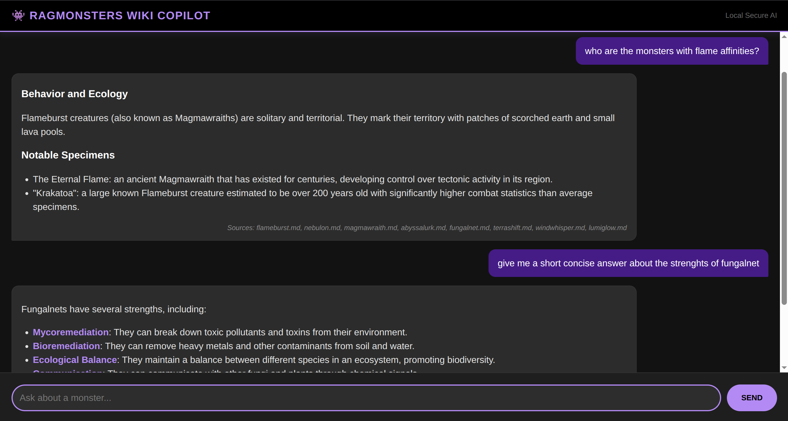

RAGMonsters Wiki Copilot (Simple Local RAG)
===========================================

This project implements a local RAG system using **Python**, **Flask**, **LangChain**, **ChromaDB**, and **Ollama**. It allows you to chat with your own Markdown notes via a dark-themed web interface without sending data to the cloud.



Features
--------

-   **Privacy-First**: Runs entirely locally using Ollama.

-   **Web Interface**: A clean, dark-themed chat UI ("RAGMonsters Wiki Copilot").

-   **Automated Setup**: Docker container handles model downloading and database building automatically.

-   **Custom Knowledge**: Ingests `.md` files from a local directory.

-   **Lightweight**: Optimized for local hardware using efficient embedding models (`nomic-embed-text`) and small LLMs (`Llama 3.2 1B`).

-   **Smart Query Routing**: Uses a classification step to detect if a user is asking a "Specific" question (retrieving precise details) or a "Broad" question (listing/summarizing multiple entities), adjusting retrieval depth accordingly.

Option 1: Docker (Recommended)
------------------------------

This method automates everything. You do not need to install Python or Ollama manually on your machine.

### Prerequisites

-   **Docker Desktop** (or Docker Engine) installed and running.

### 1\. Run the Application

Open your terminal in the project folder and run:

```
docker-compose up --build

```

**What happens next?**

1.  The containers will start.

2.  The system will automatically check if you have the required AI models. If not, it will download them (this may take a few minutes on the first run).

3.  It will check for a vector database. If one doesn't exist, it will scan your `dataset/` folder and build it.

4.  Once you see `Starting Flask App` in the logs, the app is ready.

### 2\. Access the App

Open your browser and go to: **`http://localhost:5000`**

Option 2: Manual Python Setup
-----------------------------

Use this method if you want to modify the code or run without Docker.

### Prerequisites

1.  **Python 3.10+** installed.

2.  [**Ollama**](https://ollama.com/ "null") installed and running.

### 1\. Install Dependencies

```
python3 -m venv .venv
source .venv/bin/activate  # Windows: .venv\Scripts\activate
pip install -r requirements.txt

```

### 2\. Pull Ollama Models

You must download the specific models used in the code manually:

```
ollama pull nomic-embed-text
ollama pull hf.co/bartowski/Llama-3.2-1B-Instruct-GGUF

```

### 3\. Build the Database

Whenever you add new `.md` files to the `dataset/` folder, run:

```
python dataset.py

```

### 4\. Run the Server

```
python app.py

```

Configuration
-------------

You can adjust these variables in `docker-compose.yml` (for Docker) or `app.py` (for manual run):

-   **`EMBEDDING_MODEL`**: Defaults to `'nomic-embed-text'`. Must match a model pulled in Ollama.

-   **`chunk_size`**: (In `dataset.py`) How large the text snippets are (default `500`).

-   **`chunk_overlap`**: (In `dataset.py`) Overlap between snippets to preserve context (default `100`).

Advanced Features: Query Routing
--------------------------------

The system includes a `question_filtering` function that classifies user intent to improve answers:

-   **Specific Questions** ("What is the weight of a Flameburst?"): The system retrieves fewer, highly relevant chunks (`k=3`) to prevent hallucination.

-   **Broad Questions** ("List all monsters in the Volcanic biome"): The system detects the request for aggregation and retrieves a larger number of chunks (`k=10+`) to provide a comprehensive answer.

*Note: This classification uses "Few-Shot Prompting" and JSON mode to ensure the small 1B model follows instructions accurately.*

Troubleshooting
---------------

### Docker Issues

**Q: Error `bind: address already in use` (Port 11434)** **A:** This means Ollama is already running on your computer and conflictng with the Docker version.

-   **Fix:** Stop your local Ollama application (Quit from system tray or run `sudo service ollama stop` on Linux) and try `docker-compose up` again.

**Q: How do I rebuild the database in Docker?** **A:** If you added new notes and want to refresh the Docker database:

```
docker-compose down -v   # The -v flag deletes the database volume
docker-compose up        # Rebuilds the DB on startup

```

### General Issues

**Q: The AI is hallucinating / not finding facts.** **A:** Ensure your database is up to date.

-   **Docker:** See the rebuild instruction above.

-   **Manual:** Delete the `./vector_db` folder and run `python dataset.py`.

**Q: "Model not found" error.** **A:** Ensure the model name in your code/env matches the specific tag pulled in Ollama. Do not use HuggingFace URLs (e.g., `hf.co/...`) directly with Ollama unless you have pulled them using that exact tag.

Reference
---------

Original tutorial: https://huggingface.co/blog/ngxson/make-your-own-rag

Dataset: https://github.com/LostInBrittany/RAGmonsters